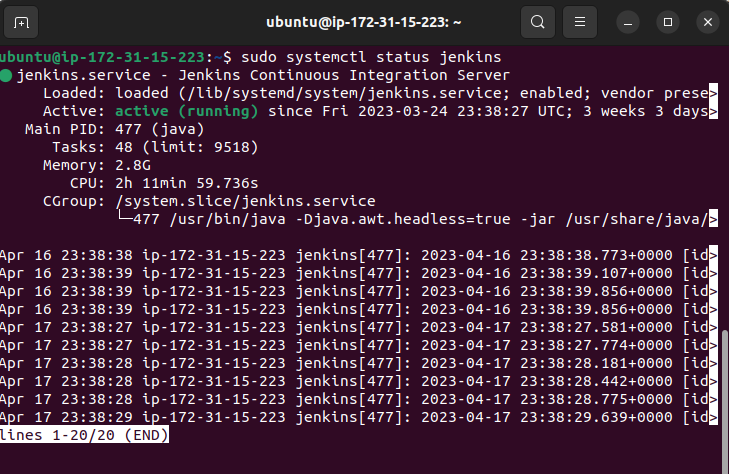

# Automate Andriod app Docker Image to Visual Studio App Center using Jenkins

### Install Jenkins



### Install SonaQube

1. Install Blue Ocean Jenkins plugins

2. Create Jenkins pipeline

### Add Dockerfile

```
FROM openjdk:11-jre-alpine
EXPOSE 8080
COPY ./build/libs/andriod-app-1.0-SNAPSHOT.jar /usr/app/
WORKDIR /usr/app
ENTRYPOINT [ "java", "-jar", "andriod-app-1.0-SNAPSHOT.jar" ]

```

### Add Jenkinsfile

