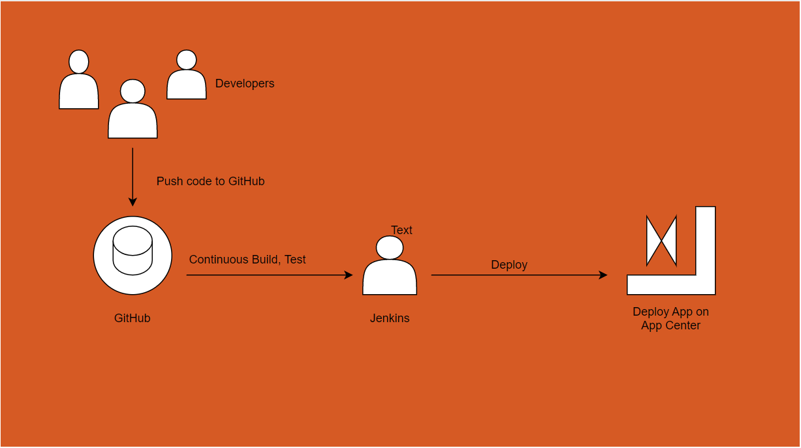
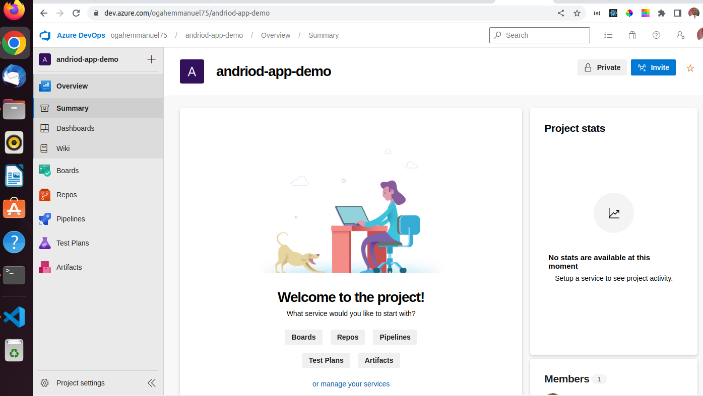
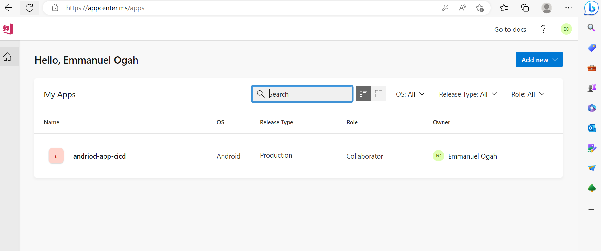
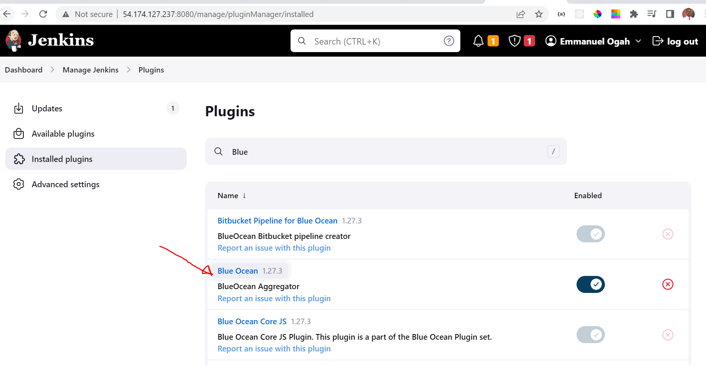
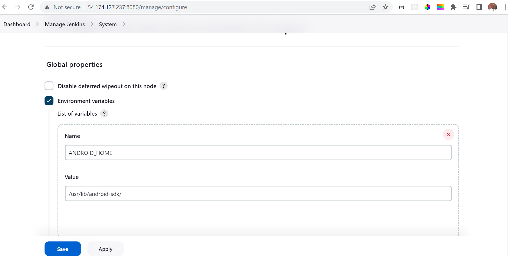
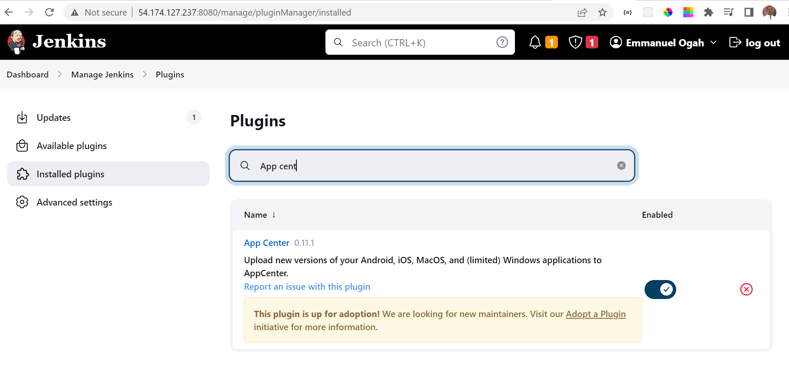
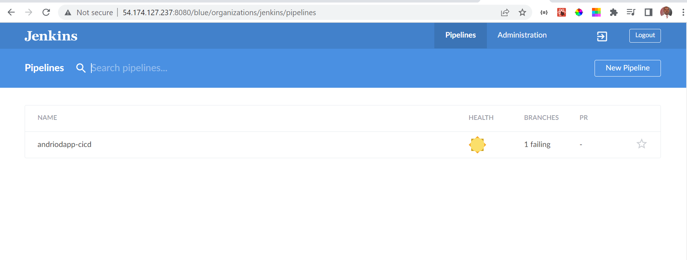
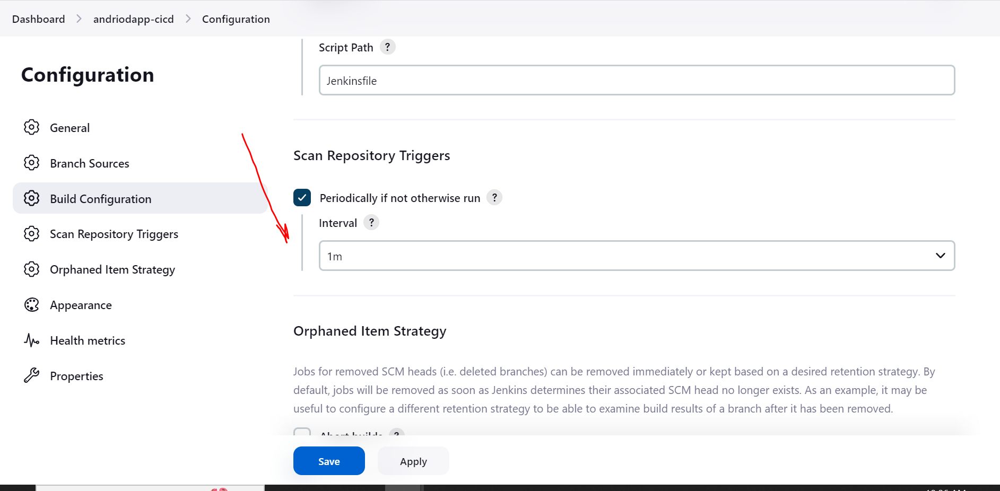
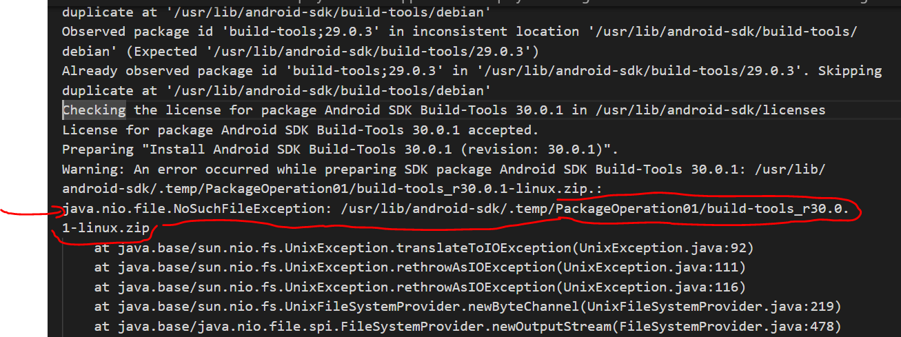

# Automated build and deploy for Mobile App


### Diagram of the components



### Visual Studio App Center

- Create App center



- Create App, Token API and Distribution group



### Deploy and configure Jenkins server

- Deploy Jenkins server and access it on the browser using _IP-Address:8080_
- Install Blue Ocean Plugin



#### Install and configure Andriod SDK

```
1. sudo apt-get update

2. sudo apt install android-sdk

3. sudo mkdir /usr/lib/android-sdk/cmdline-tools

4. cd /usr/lib/android-sdk/cmdline-tools

5. sudo  wget https://dl.google.com/android/repository/commandlinetools-linux-6609375_latest.zip

6. sudo unzip commandlinetools-linux-6609375_latest.zip 

7. sudo rm commandlinetools-linux-6609375_latest.zip  

8. rm commandlinetools-linux-6609375_latest.zip 

9. export ANDROID_HOME=/usr/lib/android-sdk/

10. export PATH=$PATH:$ANDROID_HOME/cmdline-tools/tools/bin

11. export PATH=$PATH:$ANDROID_HOME/platform-tools

12. sdkmanager --version

13. sdkmanager --list

14. sudo chmod 777 $ANDROID_HOME -R

15. yes | sdkmanager --licenses

16.  yes | sdkmanager "platform-tools" "platforms;android-29"
```

- Setup Andriod Path



- Install App center plugin



- Create a new Jenkins Pipeline



- Configure the App to build Periodically



- Create Jenkins credentials for GitHub and App center token API
- Create Jenkins file and push the updated code to GitHub

```
pipeline {

  agent any

  environment {
    APP_NAME = 'Back4AppExample'
  }

  options {
    // Stop the build early in case of compile or test failures
    skipStagesAfterUnstable()
  }

  stages {
    
    stage('Detect build type') {
    steps {
        echo "Detect the build branch..."
        script {
        if (env.BRANCH_NAME == 'master' || env.CHANGE_TARGET == 'master') {
            env.BUILD_TYPE = 'debug'
        } else if (env.BRANCH_NAME == 'dev' || env.CHANGE_TARGET == 'dev') {
            env.BUILD_TYPE = 'release'
        }
        }
    }
    }

    stage('Compile') {
        steps {
            echo "Compile the app and its dependencies..."
            sh './gradlew compile${BUILD_TYPE}Sources'
        }
    } 

    stage('Build') {
        steps {
            echo "Build the andriod application..."
            sh './gradlew assemble${BUILD_TYPE}'
            sh './gradlew generatePomFileForLibraryPublication'
        }
    } 

    stage('Publish') {
        environment {
            APPCENTER_API_TOKEN = credentials('emmanuel-appcenter-api-token')
        }
        steps {
            appCenter apiToken: APPCENTER_API_TOKEN,
                    ownerName: 'emmanuel ogah',
                    appName: 'andriod-app-cicd',
                    pathToApp: '**/${APP_NAME}-${BUILD_TYPE}.apk',
                    distributionGroups: 'emmanuel ogah'
        }
    }

  }
}
```

- The CICD is triggered periodically to detect any changes and build/Deploy

_However, i got error that held me for days now. The Andriod SDK issue._



```
Started by user Emmanuel Ogah
Connecting to https://api.github.com using Emmy-github-webdev/******
Obtained Jenkinsfile from acd55c0cda451da486b77f5c507fd03e56e62d28
[Pipeline] Start of Pipeline
[Pipeline] node
Running on Jenkins in /var/lib/jenkins/workspace/andriodapp-cicd_dev
[Pipeline] {
[Pipeline] stage
[Pipeline] { (Declarative: Checkout SCM)
[Pipeline] checkout
The recommended git tool is: NONE
using credential github-credentials
 > git rev-parse --resolve-git-dir /var/lib/jenkins/workspace/andriodapp-cicd_dev/.git # timeout=10
Fetching changes from the remote Git repository
 > git config remote.origin.url https://github.com/Emmy-github-webdev/andriodapp-cicd.git # timeout=10
Cleaning workspace
 > git rev-parse --verify HEAD # timeout=10
Resetting working tree
 > git reset --hard # timeout=10
 > git clean -fdx # timeout=10
Fetching without tags
Fetching upstream changes from https://github.com/Emmy-github-webdev/andriodapp-cicd.git
 > git --version # timeout=10
 > git --version # 'git version 2.34.1'
using GIT_ASKPASS to set credentials 
 > git fetch --no-tags --force --progress -- https://github.com/Emmy-github-webdev/andriodapp-cicd.git +refs/heads/dev:refs/remotes/origin/dev # timeout=10
Checking out Revision acd55c0cda451da486b77f5c507fd03e56e62d28 (dev)
 > git config core.sparsecheckout # timeout=10
 > git checkout -f acd55c0cda451da486b77f5c507fd03e56e62d28 # timeout=10
 > git branch -a -v --no-abbrev # timeout=10
 > git branch -D dev # timeout=10
 > git checkout -b dev acd55c0cda451da486b77f5c507fd03e56e62d28 # timeout=10
Commit message: "Add jenkins file"
 > git rev-list --no-walk acd55c0cda451da486b77f5c507fd03e56e62d28 # timeout=10
Cleaning workspace
 > git rev-parse --verify HEAD # timeout=10
Resetting working tree
 > git reset --hard # timeout=10
 > git clean -fdx # timeout=10
[Pipeline] }
[Pipeline] // stage
[Pipeline] withEnv
[Pipeline] {
[Pipeline] withEnv
[Pipeline] {
[Pipeline] stage
[Pipeline] { (Detect build type)
[Pipeline] echo
Detect the build branch...
[Pipeline] script
[Pipeline] {
[Pipeline] }
[Pipeline] // script
[Pipeline] }
[Pipeline] // stage
[Pipeline] stage
[Pipeline] { (Compile)
[Pipeline] echo
Compile the app and its dependencies...
[Pipeline] sh
+ ./gradlew compilereleaseSources
Starting a Gradle Daemon (subsequent builds will be faster)
Observed package id 'build-tools;29.0.3' in inconsistent location '/usr/lib/android-sdk/build-tools/debian' (Expected '/usr/lib/android-sdk/build-tools/29.0.3')
Already observed package id 'build-tools;29.0.3' in '/usr/lib/android-sdk/build-tools/29.0.3'. Skipping duplicate at '/usr/lib/android-sdk/build-tools/debian'
Observed package id 'build-tools;29.0.3' in inconsistent location '/usr/lib/android-sdk/build-tools/debian' (Expected '/usr/lib/android-sdk/build-tools/29.0.3')
Already observed package id 'build-tools;29.0.3' in '/usr/lib/android-sdk/build-tools/29.0.3'. Skipping duplicate at '/usr/lib/android-sdk/build-tools/debian'
Checking the license for package Android SDK Build-Tools 30.0.1 in /usr/lib/android-sdk/licenses
License for package Android SDK Build-Tools 30.0.1 accepted.
Preparing "Install Android SDK Build-Tools 30.0.1 (revision: 30.0.1)".
Warning: An error occurred while preparing SDK package Android SDK Build-Tools 30.0.1: /usr/lib/android-sdk/.temp/PackageOperation01/build-tools_r30.0.1-linux.zip.:
java.nio.file.NoSuchFileException: /usr/lib/android-sdk/.temp/PackageOperation01/build-tools_r30.0.1-linux.zip
	at java.base/sun.nio.fs.UnixException.translateToIOException(UnixException.java:92)
	at java.base/sun.nio.fs.UnixException.rethrowAsIOException(UnixException.java:111)
	at java.base/sun.nio.fs.UnixException.rethrowAsIOException(UnixException.java:116)
	at java.base/sun.nio.fs.UnixFileSystemProvider.newByteChannel(UnixFileSystemProvider.java:219)
	at java.base/java.nio.file.spi.FileSystemProvider.newOutputStream(FileSystemProvider.java:478)
	at java.base/java.nio.file.Files.newOutputStream(Files.java:220)
	at com.android.repository.io.impl.FileSystemFileOp.newFileOutputStream(FileSystemFileOp.java:246)
	at com.android.repository.io.impl.FileSystemFileOp.newFileOutputStream(FileSystemFileOp.java:234)
	at com.android.sdklib.repository.legacy.LegacyDownloader.downloadFully(LegacyDownloader.java:88)
	at com.android.repository.impl.downloader.LocalFileAwareDownloader.downloadFully(LocalFileAwareDownloader.java:82)
	at com.android.repository.api.Downloader.downloadFullyWithCaching(Downloader.java:105)
	at com.android.repository.impl.installer.BasicInstaller.doPrepare(BasicInstaller.java:71)
	at com.android.repository.impl.installer.AbstractPackageOperation.prepare(AbstractPackageOperation.java:337)
	at com.android.builder.sdk.DefaultSdkLoader.installRemotePackages(DefaultSdkLoader.java:361)
	at com.android.builder.sdk.DefaultSdkLoader.installBuildTools(DefaultSdkLoader.java:313)
	at com.android.builder.sdk.DefaultSdkLoader.getTargetInfo(DefaultSdkLoader.java:150)
	at com.android.build.gradle.internal.SdkHandler.initTarget(SdkHandler.java:113)
	at com.android.build.gradle.internal.SdkFullLoadingStrategy.init(SdkFullLoadingStrategy.kt:49)
	at com.android.build.gradle.internal.SdkFullLoadingStrategy.getTargetBootClasspath(SdkFullLoadingStrategy.kt:70)
	at com.android.build.gradle.internal.SdkLoadingStrategy.getTargetBootClasspath(SdkLoadingStrategy.kt:35)
	at com.android.build.gradle.internal.SdkComponentsBuildService$targetBootClasspathProvider$1.call(SdkComponents.kt:186)
	at com.android.build.gradle.internal.SdkComponentsBuildService$targetBootClasspathProvider$1.call(SdkComponents.kt:57)
	at org.gradle.api.internal.provider.DefaultProvider.calculateOwnValue(DefaultProvider.java:66)
	at org.gradle.api.internal.provider.AbstractMinimalProvider.calculateValue(AbstractMinimalProvider.java:103)
	at org.gradle.api.internal.provider.FlatMapProvider.calculateOwnValue(FlatMapProvider.java:50)
	at org.gradle.api.internal.provider.AbstractMinimalProvider.calculateValue(AbstractMinimalProvider.java:103)
	at org.gradle.api.internal.provider.TransformBackedProvider.calculateOwnValue(TransformBackedProvider.java:64)
	at org.gradle.api.internal.provider.AbstractMinimalProvider.get(AbstractMinimalProvider.java:84)
	at com.android.build.gradle.internal.scope.GlobalScope.lambda$getBootClasspath$8(GlobalScope.java:359)
	at org.gradle.api.internal.provider.DefaultProvider.calculateOwnValue(DefaultProvider.java:66)
	at org.gradle.api.internal.provider.AbstractMinimalProvider.get(AbstractMinimalProvider.java:84)
	at org.gradle.api.internal.file.collections.UnpackingVisitor.add(UnpackingVisitor.java:56)
	at org.gradle.api.internal.file.collections.DefaultConfigurableFileCollection$UnresolvedItemsCollector.visitContents(DefaultConfigurableFileCollection.java:300)
	at org.gradle.api.internal.file.collections.DefaultConfigurableFileCollection.visitContents(DefaultConfigurableFileCollection.java:224)
	at org.gradle.api.internal.file.CompositeFileCollection.visitDependencies(CompositeFileCollection.java:140)
	at org.gradle.api.internal.file.collections.DefaultConfigurableFileCollection.visitDependencies(DefaultConfigurableFileCollection.java:230)
	at org.gradle.api.internal.tasks.CachingTaskDependencyResolveContext$TaskGraphImpl.getNodeValues(CachingTaskDependencyResolveContext.java:112)
	at org.gradle.internal.graph.CachingDirectedGraphWalker$GraphWithEmptyEdges.getNodeValues(CachingDirectedGraphWalker.java:213)
	at org.gradle.internal.graph.CachingDirectedGraphWalker.doSearch(CachingDirectedGraphWalker.java:121)
	at org.gradle.internal.graph.CachingDirectedGraphWalker.findValues(CachingDirectedGraphWalker.java:73)
	at org.gradle.api.internal.tasks.CachingTaskDependencyResolveContext.getDependencies(CachingTaskDependencyResolveContext.java:67)
	at org.gradle.execution.plan.TaskDependencyResolver.resolveDependenciesFor(TaskDependencyResolver.java:46)
	at org.gradle.execution.plan.LocalTaskNode.getDependencies(LocalTaskNode.java:161)
	at org.gradle.execution.plan.LocalTaskNode.resolveDependencies(LocalTaskNode.java:129)
	at org.gradle.execution.plan.DefaultExecutionPlan.doAddNodes(DefaultExecutionPlan.java:165)
	at org.gradle.execution.plan.DefaultExecutionPlan.addEntryTasks(DefaultExecutionPlan.java:135)
	at org.gradle.execution.taskgraph.DefaultTaskExecutionGraph.addEntryTasks(DefaultTaskExecutionGraph.java:144)
	at org.gradle.execution.TaskNameResolvingBuildConfigurationAction.configure(TaskNameResolvingBuildConfigurationAction.java:49)
	at org.gradle.execution.DefaultBuildConfigurationActionExecuter.configure(DefaultBuildConfigurationActionExecuter.java:58)
	at org.gradle.execution.DefaultBuildConfigurationActionExecuter.access$200(DefaultBuildConfigurationActionExecuter.java:26)
	at org.gradle.execution.DefaultBuildConfigurationActionExecuter$2.proceed(DefaultBuildConfigurationActionExecuter.java:66)
	at org.gradle.execution.DefaultTasksBuildExecutionAction.configure(DefaultTasksBuildExecutionAction.java:45)
	at org.gradle.execution.DefaultBuildConfigurationActionExecuter.configure(DefaultBuildConfigurationActionExecuter.java:58)
	at org.gradle.execution.DefaultBuildConfigurationActionExecuter.access$200(DefaultBuildConfigurationActionExecuter.java:26)
	at org.gradle.execution.DefaultBuildConfigurationActionExecuter$2.proceed(DefaultBuildConfigurationActionExecuter.java:66)
	at org.gradle.execution.ExcludedTaskFilteringBuildConfigurationAction.configure(ExcludedTaskFilteringBuildConfigurationAction.java:48)
	at org.gradle.execution.DefaultBuildConfigurationActionExecuter.configure(DefaultBuildConfigurationActionExecuter.java:58)
	at org.gradle.execution.DefaultBuildConfigurationActionExecuter.access$200(DefaultBuildConfigurationActionExecuter.java:26)
	at org.gradle.execution.DefaultBuildConfigurationActionExecuter$1.run(DefaultBuildConfigurationActionExecuter.java:44)
	at org.gradle.internal.Factories$1.create(Factories.java:26)
	at org.gradle.api.internal.project.DefaultProjectStateRegistry.withLenientState(DefaultProjectStateRegistry.java:134)
	at org.gradle.api.internal.project.DefaultProjectStateRegistry.withLenientState(DefaultProjectStateRegistry.java:126)
	at org.gradle.execution.DefaultBuildConfigurationActionExecuter.select(DefaultBuildConfigurationActionExecuter.java:40)
	at org.gradle.initialization.DefaultTaskExecutionPreparer.prepareForTaskExecution(DefaultTaskExecutionPreparer.java:38)
	at org.gradle.initialization.BuildOperatingFiringTaskExecutionPreparer$CalculateTaskGraph.populateTaskGraph(BuildOperatingFiringTaskExecutionPreparer.java:117)
	at org.gradle.initialization.BuildOperatingFiringTaskExecutionPreparer$CalculateTaskGraph.run(BuildOperatingFiringTaskExecutionPreparer.java:68)
	at org.gradle.internal.operations.DefaultBuildOperationExecutor$RunnableBuildOperationWorker.execute(DefaultBuildOperationExecutor.java:395)
	at org.gradle.internal.operations.DefaultBuildOperationExecutor$RunnableBuildOperationWorker.execute(DefaultBuildOperationExecutor.java:387)
	at org.gradle.internal.operations.DefaultBuildOperationExecutor$1.execute(DefaultBuildOperationExecutor.java:157)
	at org.gradle.internal.operations.DefaultBuildOperationExecutor.execute(DefaultBuildOperationExecutor.java:242)
	at org.gradle.internal.operations.DefaultBuildOperationExecutor.execute(DefaultBuildOperationExecutor.java:150)
	at org.gradle.internal.operations.DefaultBuildOperationExecutor.run(DefaultBuildOperationExecutor.java:84)
	at org.gradle.internal.operations.DelegatingBuildOperationExecutor.run(DelegatingBuildOperationExecutor.java:31)
	at org.gradle.initialization.BuildOperatingFiringTaskExecutionPreparer.prepareForTaskExecution(BuildOperatingFiringTaskExecutionPreparer.java:56)
	at org.gradle.initialization.DefaultGradleLauncher.prepareTaskExecution(DefaultGradleLauncher.java:227)
	at org.gradle.initialization.DefaultGradleLauncher.doClassicBuildStages(DefaultGradleLauncher.java:159)
	at org.gradle.initialization.DefaultGradleLauncher.doBuildStages(DefaultGradleLauncher.java:140)
	at org.gradle.initialization.DefaultGradleLauncher.executeTasks(DefaultGradleLauncher.java:120)
	at org.gradle.internal.invocation.GradleBuildController$1.create(GradleBuildController.java:74)
	at org.gradle.internal.invocation.GradleBuildController$1.create(GradleBuildController.java:67)
	at org.gradle.internal.work.DefaultWorkerLeaseService.withLocks(DefaultWorkerLeaseService.java:180)
	at org.gradle.internal.work.StopShieldingWorkerLeaseService.withLocks(StopShieldingWorkerLeaseService.java:40)
	at org.gradle.internal.invocation.GradleBuildController.doBuild(GradleBuildController.java:67)
	at org.gradle.internal.invocation.GradleBuildController.run(GradleBuildController.java:56)
	at org.gradle.tooling.internal.provider.ExecuteBuildActionRunner.run(ExecuteBuildActionRunner.java:31)
	at org.gradle.launcher.exec.ChainingBuildActionRunner.run(ChainingBuildActionRunner.java:35)
	at org.gradle.launcher.exec.BuildOutcomeReportingBuildActionRunner.run(BuildOutcomeReportingBuildActionRunner.java:63)
	at org.gradle.tooling.internal.provider.ValidatingBuildActionRunner.run(ValidatingBuildActionRunner.java:32)
	at org.gradle.launcher.exec.BuildCompletionNotifyingBuildActionRunner.run(BuildCompletionNotifyingBuildActionRunner.java:39)
	at org.gradle.launcher.exec.RunAsBuildOperationBuildActionRunner$3.call(RunAsBuildOperationBuildActionRunner.java:51)
	at org.gradle.launcher.exec.RunAsBuildOperationBuildActionRunner$3.call(RunAsBuildOperationBuildActionRunner.java:45)
	at org.gradle.internal.operations.DefaultBuildOperationExecutor$CallableBuildOperationWorker.execute(DefaultBuildOperationExecutor.java:409)
	at org.gradle.internal.operations.DefaultBuildOperationExecutor$CallableBuildOperationWorker.execute(DefaultBuildOperationExecutor.java:399)
	at org.gradle.internal.operations.DefaultBuildOperationExecutor$1.execute(DefaultBuildOperationExecutor.java:157)
	at org.gradle.internal.operations.DefaultBuildOperationExecutor.execute(DefaultBuildOperationExecutor.java:242)
	at org.gradle.internal.operations.DefaultBuildOperationExecutor.execute(DefaultBuildOperationExecutor.java:150)
	at org.gradle.internal.operations.DefaultBuildOperationExecutor.call(DefaultBuildOperationExecutor.java:94)
	at org.gradle.internal.operations.DelegatingBuildOperationExecutor.call(DelegatingBuildOperationExecutor.java:36)
	at org.gradle.launcher.exec.RunAsBuildOperationBuildActionRunner.run(RunAsBuildOperationBuildActionRunner.java:45)
	at org.gradle.launcher.exec.InProcessBuildActionExecuter$1.transform(InProcessBuildActionExecuter.java:50)
	at org.gradle.launcher.exec.InProcessBuildActionExecuter$1.transform(InProcessBuildActionExecuter.java:47)
	at org.gradle.composite.internal.DefaultRootBuildState.run(DefaultRootBuildState.java:80)
	at org.gradle.launcher.exec.InProcessBuildActionExecuter.execute(InProcessBuildActionExecuter.java:47)
	at org.gradle.launcher.exec.InProcessBuildActionExecuter.execute(InProcessBuildActionExecuter.java:31)
	at org.gradle.launcher.exec.BuildTreeScopeBuildActionExecuter.execute(BuildTreeScopeBuildActionExecuter.java:42)
	at org.gradle.launcher.exec.BuildTreeScopeBuildActionExecuter.execute(BuildTreeScopeBuildActionExecuter.java:28)
	at org.gradle.tooling.internal.provider.ContinuousBuildActionExecuter.execute(ContinuousBuildActionExecuter.java:87)
	at org.gradle.tooling.internal.provider.ContinuousBuildActionExecuter.execute(ContinuousBuildActionExecuter.java:55)
	at org.gradle.tooling.internal.provider.SubscribableBuildActionExecuter.execute(SubscribableBuildActionExecuter.java:60)
	at org.gradle.tooling.internal.provider.SubscribableBuildActionExecuter.execute(SubscribableBuildActionExecuter.java:38)
	at org.gradle.tooling.internal.provider.SessionScopeBuildActionExecuter.execute(SessionScopeBuildActionExecuter.java:68)
	at org.gradle.tooling.internal.provider.SessionScopeBuildActionExecuter.execute(SessionScopeBuildActionExecuter.java:38)
	at org.gradle.tooling.internal.provider.GradleThreadBuildActionExecuter.execute(GradleThreadBuildActionExecuter.java:37)
	at org.gradle.tooling.internal.provider.GradleThreadBuildActionExecuter.execute(GradleThreadBuildActionExecuter.java:26)
	at org.gradle.tooling.internal.provider.StartParamsValidatingActionExecuter.execute(StartParamsValidatingActionExecuter.java:60)
	at org.gradle.tooling.internal.provider.StartParamsValidatingActionExecuter.execute(StartParamsValidatingActionExecuter.java:32)
	at org.gradle.tooling.internal.provider.SessionFailureReportingActionExecuter.execute(SessionFailureReportingActionExecuter.java:56)
	at org.gradle.tooling.internal.provider.SessionFailureReportingActionExecuter.execute(SessionFailureReportingActionExecuter.java:42)
	at org.gradle.tooling.internal.provider.SetupLoggingActionExecuter.execute(SetupLoggingActionExecuter.java:48)
	at org.gradle.tooling.internal.provider.SetupLoggingActionExecuter.execute(SetupLoggingActionExecuter.java:32)
	at org.gradle.launcher.daemon.server.exec.ExecuteBuild.doBuild(ExecuteBuild.java:68)
	at org.gradle.launcher.daemon.server.exec.BuildCommandOnly.execute(BuildCommandOnly.java:37)
	at org.gradle.launcher.daemon.server.api.DaemonCommandExecution.proceed(DaemonCommandExecution.java:104)
	at org.gradle.launcher.daemon.server.exec.WatchForDisconnection.execute(WatchForDisconnection.java:39)
	at org.gradle.launcher.daemon.server.api.DaemonCommandExecution.proceed(DaemonCommandExecution.java:104)
	at org.gradle.launcher.daemon.server.exec.ResetDeprecationLogger.execute(ResetDeprecationLogger.java:29)
	at org.gradle.launcher.daemon.server.api.DaemonCommandExecution.proceed(DaemonCommandExecution.java:104)
	at org.gradle.launcher.daemon.server.exec.RequestStopIfSingleUsedDaemon.execute(RequestStopIfSingleUsedDaemon.java:35)
	at org.gradle.launcher.daemon.server.api.DaemonCommandExecution.proceed(DaemonCommandExecution.java:104)
	at org.gradle.launcher.daemon.server.exec.ForwardClientInput$2.create(ForwardClientInput.java:78)
	at org.gradle.launcher.daemon.server.exec.ForwardClientInput$2.create(ForwardClientInput.java:75)
	at org.gradle.util.Swapper.swap(Swapper.java:38)
	at org.gradle.launcher.daemon.server.exec.ForwardClientInput.execute(ForwardClientInput.java:75)
	at org.gradle.launcher.daemon.server.api.DaemonCommandExecution.proceed(DaemonCommandExecution.java:104)
	at org.gradle.launcher.daemon.server.exec.LogAndCheckHealth.execute(LogAndCheckHealth.java:55)
	at org.gradle.launcher.daemon.server.api.DaemonCommandExecution.proceed(DaemonCommandExecution.java:104)
	at org.gradle.launcher.daemon.server.exec.LogToClient.doBuild(LogToClient.java:63)
	at org.gradle.launcher.daemon.server.exec.BuildCommandOnly.execute(BuildCommandOnly.java:37)
	at org.gradle.launcher.daemon.server.api.DaemonCommandExecution.proceed(DaemonCommandExecution.java:104)
	at org.gradle.launcher.daemon.server.exec.EstablishBuildEnvironment.doBuild(EstablishBuildEnvironment.java:82)
	at org.gradle.launcher.daemon.server.exec.BuildCommandOnly.execute(BuildCommandOnly.java:37)
	at org.gradle.launcher.daemon.server.api.DaemonCommandExecution.proceed(DaemonCommandExecution.java:104)
	at org.gradle.launcher.daemon.server.exec.StartBuildOrRespondWithBusy$1.run(StartBuildOrRespondWithBusy.java:52)
	at org.gradle.launcher.daemon.server.DaemonStateCoordinator$1.run(DaemonStateCoordinator.java:297)
	at org.gradle.internal.concurrent.ExecutorPolicy$CatchAndRecordFailures.onExecute(ExecutorPolicy.java:64)
	at org.gradle.internal.concurrent.ManagedExecutorImpl$1.run(ManagedExecutorImpl.java:48)
	at java.base/java.util.concurrent.ThreadPoolExecutor.runWorker(ThreadPoolExecutor.java:1128)
	at java.base/java.util.concurrent.ThreadPoolExecutor$Worker.run(ThreadPoolExecutor.java:628)
	at org.gradle.internal.concurrent.ThreadFactoryImpl$ManagedThreadRunnable.run(ThreadFactoryImpl.java:56)
	at java.base/java.lang.Thread.run(Thread.java:829)
"Install Android SDK Build-Tools 30.0.1 (revision: 30.0.1)" failed.
Checking the license for package Android SDK Platform 30 in /usr/lib/android-sdk/licenses
License for package Android SDK Platform 30 accepted.
Preparing "Install Android SDK Platform 30 (revision: 3)".
Warning: An error occurred while preparing SDK package Android SDK Platform 30: /usr/lib/android-sdk/.temp/PackageOperation01/platform-30_r03.zip.:
java.nio.file.NoSuchFileException: /usr/lib/android-sdk/.temp/PackageOperation01/platform-30_r03.zip
	at java.base/sun.nio.fs.UnixException.translateToIOException(UnixException.java:92)
	at java.base/sun.nio.fs.UnixException.rethrowAsIOException(UnixException.java:111)
	at java.base/sun.nio.fs.UnixException.rethrowAsIOException(UnixException.java:116)
	at java.base/sun.nio.fs.UnixFileSystemProvider.newByteChannel(UnixFileSystemProvider.java:219)
	at java.base/java.nio.file.spi.FileSystemProvider.newOutputStream(FileSystemProvider.java:478)
	at java.base/java.nio.file.Files.newOutputStream(Files.java:220)
	at com.android.repository.io.impl.FileSystemFileOp.newFileOutputStream(FileSystemFileOp.java:246)
	at com.android.repository.io.impl.FileSystemFileOp.newFileOutputStream(FileSystemFileOp.java:234)
	at com.android.sdklib.repository.legacy.LegacyDownloader.downloadFully(LegacyDownloader.java:88)
	at com.android.repository.impl.downloader.LocalFileAwareDownloader.downloadFully(LocalFileAwareDownloader.java:82)
	at com.android.repository.api.Downloader.downloadFullyWithCaching(Downloader.java:105)
	at com.android.repository.impl.installer.BasicInstaller.doPrepare(BasicInstaller.java:71)
	at com.android.repository.impl.installer.AbstractPackageOperation.prepare(AbstractPackageOperation.java:337)
	at com.android.builder.sdk.DefaultSdkLoader.installRemotePackages(DefaultSdkLoader.java:361)
	at com.android.builder.sdk.DefaultSdkLoader.installTarget(DefaultSdkLoader.java:239)
	at com.android.builder.sdk.DefaultSdkLoader.getTargetInfo(DefaultSdkLoader.java:156)
	at com.android.build.gradle.internal.SdkHandler.initTarget(SdkHandler.java:113)
	at com.android.build.gradle.internal.SdkFullLoadingStrategy.init(SdkFullLoadingStrategy.kt:49)
	at com.android.build.gradle.internal.SdkFullLoadingStrategy.getTargetBootClasspath(SdkFullLoadingStrategy.kt:70)
	at com.android.build.gradle.internal.SdkLoadingStrategy.getTargetBootClasspath(SdkLoadingStrategy.kt:35)
	at com.android.build.gradle.internal.SdkComponentsBuildService$targetBootClasspathProvider$1.call(SdkComponents.kt:186)
	at com.android.build.gradle.internal.SdkComponentsBuildService$targetBootClasspathProvider$1.call(SdkComponents.kt:57)
	at org.gradle.api.internal.provider.DefaultProvider.calculateOwnValue(DefaultProvider.java:66)
	at org.gradle.api.internal.provider.AbstractMinimalProvider.calculateValue(AbstractMinimalProvider.java:103)
	at org.gradle.api.internal.provider.FlatMapProvider.calculateOwnValue(FlatMapProvider.java:50)
	at org.gradle.api.internal.provider.AbstractMinimalProvider.calculateValue(AbstractMinimalProvider.java:103)
	at org.gradle.api.internal.provider.TransformBackedProvider.calculateOwnValue(TransformBackedProvider.java:64)
	at org.gradle.api.internal.provider.AbstractMinimalProvider.get(AbstractMinimalProvider.java:84)
	at com.android.build.gradle.internal.scope.GlobalScope.lambda$getBootClasspath$8(GlobalScope.java:359)
	at org.gradle.api.internal.provider.DefaultProvider.calculateOwnValue(DefaultProvider.java:66)
	at org.gradle.api.internal.provider.AbstractMinimalProvider.get(AbstractMinimalProvider.java:84)
	at org.gradle.api.internal.file.collections.UnpackingVisitor.add(UnpackingVisitor.java:56)
	at org.gradle.api.internal.file.collections.DefaultConfigurableFileCollection$UnresolvedItemsCollector.visitContents(DefaultConfigurableFileCollection.java:300)
	at org.gradle.api.internal.file.collections.DefaultConfigurableFileCollection.visitContents(DefaultConfigurableFileCollection.java:224)
	at org.gradle.api.internal.file.CompositeFileCollection.visitDependencies(CompositeFileCollection.java:140)
	at org.gradle.api.internal.file.collections.DefaultConfigurableFileCollection.visitDependencies(DefaultConfigurableFileCollection.java:230)
	at org.gradle.api.internal.tasks.CachingTaskDependencyResolveContext$TaskGraphImpl.getNodeValues(CachingTaskDependencyResolveContext.java:112)
	at org.gradle.internal.graph.CachingDirectedGraphWalker$GraphWithEmptyEdges.getNodeValues(CachingDirectedGraphWalker.java:213)
	at org.gradle.internal.graph.CachingDirectedGraphWalker.doSearch(CachingDirectedGraphWalker.java:121)
	at org.gradle.internal.graph.CachingDirectedGraphWalker.findValues(CachingDirectedGraphWalker.java:73)
	at org.gradle.api.internal.tasks.CachingTaskDependencyResolveContext.getDependencies(CachingTaskDependencyResolveContext.java:67)
	at org.gradle.execution.plan.TaskDependencyResolver.resolveDependenciesFor(TaskDependencyResolver.java:46)
	at org.gradle.execution.plan.LocalTaskNode.getDependencies(LocalTaskNode.java:161)
	at org.gradle.execution.plan.LocalTaskNode.resolveDependencies(LocalTaskNode.java:129)
	at org.gradle.execution.plan.DefaultExecutionPlan.doAddNodes(DefaultExecutionPlan.java:165)
	at org.gradle.execution.plan.DefaultExecutionPlan.addEntryTasks(DefaultExecutionPlan.java:135)
	at org.gradle.execution.taskgraph.DefaultTaskExecutionGraph.addEntryTasks(DefaultTaskExecutionGraph.java:144)
	at org.gradle.execution.TaskNameResolvingBuildConfigurationAction.configure(TaskNameResolvingBuildConfigurationAction.java:49)
	at org.gradle.execution.DefaultBuildConfigurationActionExecuter.configure(DefaultBuildConfigurationActionExecuter.java:58)
	at org.gradle.execution.DefaultBuildConfigurationActionExecuter.access$200(DefaultBuildConfigurationActionExecuter.java:26)
	at org.gradle.execution.DefaultBuildConfigurationActionExecuter$2.proceed(DefaultBuildConfigurationActionExecuter.java:66)
	at org.gradle.execution.DefaultTasksBuildExecutionAction.configure(DefaultTasksBuildExecutionAction.java:45)
	at org.gradle.execution.DefaultBuildConfigurationActionExecuter.configure(DefaultBuildConfigurationActionExecuter.java:58)
	at org.gradle.execution.DefaultBuildConfigurationActionExecuter.access$200(DefaultBuildConfigurationActionExecuter.java:26)
	at org.gradle.execution.DefaultBuildConfigurationActionExecuter$2.proceed(DefaultBuildConfigurationActionExecuter.java:66)
	at org.gradle.execution.ExcludedTaskFilteringBuildConfigurationAction.configure(ExcludedTaskFilteringBuildConfigurationAction.java:48)
	at org.gradle.execution.DefaultBuildConfigurationActionExecuter.configure(DefaultBuildConfigurationActionExecuter.java:58)
	at org.gradle.execution.DefaultBuildConfigurationActionExecuter.access$200(DefaultBuildConfigurationActionExecuter.java:26)
	at org.gradle.execution.DefaultBuildConfigurationActionExecuter$1.run(DefaultBuildConfigurationActionExecuter.java:44)
	at org.gradle.internal.Factories$1.create(Factories.java:26)
	at org.gradle.api.internal.project.DefaultProjectStateRegistry.withLenientState(DefaultProjectStateRegistry.java:134)
	at org.gradle.api.internal.project.DefaultProjectStateRegistry.withLenientState(DefaultProjectStateRegistry.java:126)
	at org.gradle.execution.DefaultBuildConfigurationActionExecuter.select(DefaultBuildConfigurationActionExecuter.java:40)
	at org.gradle.initialization.DefaultTaskExecutionPreparer.prepareForTaskExecution(DefaultTaskExecutionPreparer.java:38)
	at org.gradle.initialization.BuildOperatingFiringTaskExecutionPreparer$CalculateTaskGraph.populateTaskGraph(BuildOperatingFiringTaskExecutionPreparer.java:117)
	at org.gradle.initialization.BuildOperatingFiringTaskExecutionPreparer$CalculateTaskGraph.run(BuildOperatingFiringTaskExecutionPreparer.java:68)
	at org.gradle.internal.operations.DefaultBuildOperationExecutor$RunnableBuildOperationWorker.execute(DefaultBuildOperationExecutor.java:395)
	at org.gradle.internal.operations.DefaultBuildOperationExecutor$RunnableBuildOperationWorker.execute(DefaultBuildOperationExecutor.java:387)
	at org.gradle.internal.operations.DefaultBuildOperationExecutor$1.execute(DefaultBuildOperationExecutor.java:157)
	at org.gradle.internal.operations.DefaultBuildOperationExecutor.execute(DefaultBuildOperationExecutor.java:242)
	at org.gradle.internal.operations.DefaultBuildOperationExecutor.execute(DefaultBuildOperationExecutor.java:150)
	at org.gradle.internal.operations.DefaultBuildOperationExecutor.run(DefaultBuildOperationExecutor.java:84)
	at org.gradle.internal.operations.DelegatingBuildOperationExecutor.run(DelegatingBuildOperationExecutor.java:31)
	at org.gradle.initialization.BuildOperatingFiringTaskExecutionPreparer.prepareForTaskExecution(BuildOperatingFiringTaskExecutionPreparer.java:56)
	at org.gradle.initialization.DefaultGradleLauncher.prepareTaskExecution(DefaultGradleLauncher.java:227)
	at org.gradle.initialization.DefaultGradleLauncher.doClassicBuildStages(DefaultGradleLauncher.java:159)
	at org.gradle.initialization.DefaultGradleLauncher.doBuildStages(DefaultGradleLauncher.java:140)
	at org.gradle.initialization.DefaultGradleLauncher.executeTasks(DefaultGradleLauncher.java:120)
	at org.gradle.internal.invocation.GradleBuildController$1.create(GradleBuildController.java:74)
	at org.gradle.internal.invocation.GradleBuildController$1.create(GradleBuildController.java:67)
	at org.gradle.internal.work.DefaultWorkerLeaseService.withLocks(DefaultWorkerLeaseService.java:180)
	at org.gradle.internal.work.StopShieldingWorkerLeaseService.withLocks(StopShieldingWorkerLeaseService.java:40)
	at org.gradle.internal.invocation.GradleBuildController.doBuild(GradleBuildController.java:67)
	at org.gradle.internal.invocation.GradleBuildController.run(GradleBuildController.java:56)
	at org.gradle.tooling.internal.provider.ExecuteBuildActionRunner.run(ExecuteBuildActionRunner.java:31)
	at org.gradle.launcher.exec.ChainingBuildActionRunner.run(ChainingBuildActionRunner.java:35)
	at org.gradle.launcher.exec.BuildOutcomeReportingBuildActionRunner.run(BuildOutcomeReportingBuildActionRunner.java:63)
	at org.gradle.tooling.internal.provider.ValidatingBuildActionRunner.run(ValidatingBuildActionRunner.java:32)
	at org.gradle.launcher.exec.BuildCompletionNotifyingBuildActionRunner.run(BuildCompletionNotifyingBuildActionRunner.java:39)
	at org.gradle.launcher.exec.RunAsBuildOperationBuildActionRunner$3.call(RunAsBuildOperationBuildActionRunner.java:51)
	at org.gradle.launcher.exec.RunAsBuildOperationBuildActionRunner$3.call(RunAsBuildOperationBuildActionRunner.java:45)
	at org.gradle.internal.operations.DefaultBuildOperationExecutor$CallableBuildOperationWorker.execute(DefaultBuildOperationExecutor.java:409)
	at org.gradle.internal.operations.DefaultBuildOperationExecutor$CallableBuildOperationWorker.execute(DefaultBuildOperationExecutor.java:399)
	at org.gradle.internal.operations.DefaultBuildOperationExecutor$1.execute(DefaultBuildOperationExecutor.java:157)
	at org.gradle.internal.operations.DefaultBuildOperationExecutor.execute(DefaultBuildOperationExecutor.java:242)
	at org.gradle.internal.operations.DefaultBuildOperationExecutor.execute(DefaultBuildOperationExecutor.java:150)
	at org.gradle.internal.operations.DefaultBuildOperationExecutor.call(DefaultBuildOperationExecutor.java:94)
	at org.gradle.internal.operations.DelegatingBuildOperationExecutor.call(DelegatingBuildOperationExecutor.java:36)
	at org.gradle.launcher.exec.RunAsBuildOperationBuildActionRunner.run(RunAsBuildOperationBuildActionRunner.java:45)
	at org.gradle.launcher.exec.InProcessBuildActionExecuter$1.transform(InProcessBuildActionExecuter.java:50)
	at org.gradle.launcher.exec.InProcessBuildActionExecuter$1.transform(InProcessBuildActionExecuter.java:47)
	at org.gradle.composite.internal.DefaultRootBuildState.run(DefaultRootBuildState.java:80)
	at org.gradle.launcher.exec.InProcessBuildActionExecuter.execute(InProcessBuildActionExecuter.java:47)
	at org.gradle.launcher.exec.InProcessBuildActionExecuter.execute(InProcessBuildActionExecuter.java:31)
	at org.gradle.launcher.exec.BuildTreeScopeBuildActionExecuter.execute(BuildTreeScopeBuildActionExecuter.java:42)
	at org.gradle.launcher.exec.BuildTreeScopeBuildActionExecuter.execute(BuildTreeScopeBuildActionExecuter.java:28)
	at org.gradle.tooling.internal.provider.ContinuousBuildActionExecuter.execute(ContinuousBuildActionExecuter.java:87)
	at org.gradle.tooling.internal.provider.ContinuousBuildActionExecuter.execute(ContinuousBuildActionExecuter.java:55)
	at org.gradle.tooling.internal.provider.SubscribableBuildActionExecuter.execute(SubscribableBuildActionExecuter.java:60)
	at org.gradle.tooling.internal.provider.SubscribableBuildActionExecuter.execute(SubscribableBuildActionExecuter.java:38)
	at org.gradle.tooling.internal.provider.SessionScopeBuildActionExecuter.execute(SessionScopeBuildActionExecuter.java:68)
	at org.gradle.tooling.internal.provider.SessionScopeBuildActionExecuter.execute(SessionScopeBuildActionExecuter.java:38)
	at org.gradle.tooling.internal.provider.GradleThreadBuildActionExecuter.execute(GradleThreadBuildActionExecuter.java:37)
	at org.gradle.tooling.internal.provider.GradleThreadBuildActionExecuter.execute(GradleThreadBuildActionExecuter.java:26)
	at org.gradle.tooling.internal.provider.StartParamsValidatingActionExecuter.execute(StartParamsValidatingActionExecuter.java:60)
	at org.gradle.tooling.internal.provider.StartParamsValidatingActionExecuter.execute(StartParamsValidatingActionExecuter.java:32)
	at org.gradle.tooling.internal.provider.SessionFailureReportingActionExecuter.execute(SessionFailureReportingActionExecuter.java:56)
	at org.gradle.tooling.internal.provider.SessionFailureReportingActionExecuter.execute(SessionFailureReportingActionExecuter.java:42)
	at org.gradle.tooling.internal.provider.SetupLoggingActionExecuter.execute(SetupLoggingActionExecuter.java:48)
	at org.gradle.tooling.internal.provider.SetupLoggingActionExecuter.execute(SetupLoggingActionExecuter.java:32)
	at org.gradle.launcher.daemon.server.exec.ExecuteBuild.doBuild(ExecuteBuild.java:68)
	at org.gradle.launcher.daemon.server.exec.BuildCommandOnly.execute(BuildCommandOnly.java:37)
	at org.gradle.launcher.daemon.server.api.DaemonCommandExecution.proceed(DaemonCommandExecution.java:104)
	at org.gradle.launcher.daemon.server.exec.WatchForDisconnection.execute(WatchForDisconnection.java:39)
	at org.gradle.launcher.daemon.server.api.DaemonCommandExecution.proceed(DaemonCommandExecution.java:104)
	at org.gradle.launcher.daemon.server.exec.ResetDeprecationLogger.execute(ResetDeprecationLogger.java:29)
	at org.gradle.launcher.daemon.server.api.DaemonCommandExecution.proceed(DaemonCommandExecution.java:104)
	at org.gradle.launcher.daemon.server.exec.RequestStopIfSingleUsedDaemon.execute(RequestStopIfSingleUsedDaemon.java:35)
	at org.gradle.launcher.daemon.server.api.DaemonCommandExecution.proceed(DaemonCommandExecution.java:104)
	at org.gradle.launcher.daemon.server.exec.ForwardClientInput$2.create(ForwardClientInput.java:78)
	at org.gradle.launcher.daemon.server.exec.ForwardClientInput$2.create(ForwardClientInput.java:75)
	at org.gradle.util.Swapper.swap(Swapper.java:38)
	at org.gradle.launcher.daemon.server.exec.ForwardClientInput.execute(ForwardClientInput.java:75)
	at org.gradle.launcher.daemon.server.api.DaemonCommandExecution.proceed(DaemonCommandExecution.java:104)
	at org.gradle.launcher.daemon.server.exec.LogAndCheckHealth.execute(LogAndCheckHealth.java:55)
	at org.gradle.launcher.daemon.server.api.DaemonCommandExecution.proceed(DaemonCommandExecution.java:104)
	at org.gradle.launcher.daemon.server.exec.LogToClient.doBuild(LogToClient.java:63)
	at org.gradle.launcher.daemon.server.exec.BuildCommandOnly.execute(BuildCommandOnly.java:37)
	at org.gradle.launcher.daemon.server.api.DaemonCommandExecution.proceed(DaemonCommandExecution.java:104)
	at org.gradle.launcher.daemon.server.exec.EstablishBuildEnvironment.doBuild(EstablishBuildEnvironment.java:82)
	at org.gradle.launcher.daemon.server.exec.BuildCommandOnly.execute(BuildCommandOnly.java:37)
	at org.gradle.launcher.daemon.server.api.DaemonCommandExecution.proceed(DaemonCommandExecution.java:104)
	at org.gradle.launcher.daemon.server.exec.StartBuildOrRespondWithBusy$1.run(StartBuildOrRespondWithBusy.java:52)
	at org.gradle.launcher.daemon.server.DaemonStateCoordinator$1.run(DaemonStateCoordinator.java:297)
	at org.gradle.internal.concurrent.ExecutorPolicy$CatchAndRecordFailures.onExecute(ExecutorPolicy.java:64)
	at org.gradle.internal.concurrent.ManagedExecutorImpl$1.run(ManagedExecutorImpl.java:48)
	at java.base/java.util.concurrent.ThreadPoolExecutor.runWorker(ThreadPoolExecutor.java:1128)
	at java.base/java.util.concurrent.ThreadPoolExecutor$Worker.run(ThreadPoolExecutor.java:628)
	at org.gradle.internal.concurrent.ThreadFactoryImpl$ManagedThreadRunnable.run(ThreadFactoryImpl.java:56)
	at java.base/java.lang.Thread.run(Thread.java:829)
"Install Android SDK Platform 30 (revision: 3)" failed.

FAILURE: Build failed with an exception.

* What went wrong:
Could not determine the dependencies of task ':app:compileReleaseJavaWithJavac'.
> Failed to install the following SDK components:
      platforms;android-30 Android SDK Platform 30
      build-tools;30.0.1 Android SDK Build-Tools 30.0.1
  Install the missing components using the SDK manager in Android Studio.


* Try:
Run with --stacktrace option to get the stack trace. Run with --info or --debug option to get more log output. Run with --scan to get full insights.

* Get more help at https://help.gradle.org

BUILD FAILED in 9s
[Pipeline] }
[Pipeline] // stage
[Pipeline] stage
[Pipeline] { (Build)
Stage "Build" skipped due to earlier failure(s)
[Pipeline] }
[Pipeline] // stage
[Pipeline] stage
[Pipeline] { (Publish)
Stage "Publish" skipped due to earlier failure(s)
[Pipeline] }
[Pipeline] // stage
[Pipeline] }
[Pipeline] // withEnv
[Pipeline] }
[Pipeline] // withEnv
[Pipeline] }
[Pipeline] // node
[Pipeline] End of Pipeline
ERROR: script returned exit code 1

Could not update commit status, please check if your scan credentials belong to a member of the organization or a collaborator of the repository and repo:status scope is selected


GitHub has been notified of this commit’s build result

Finished: FAILURE
```